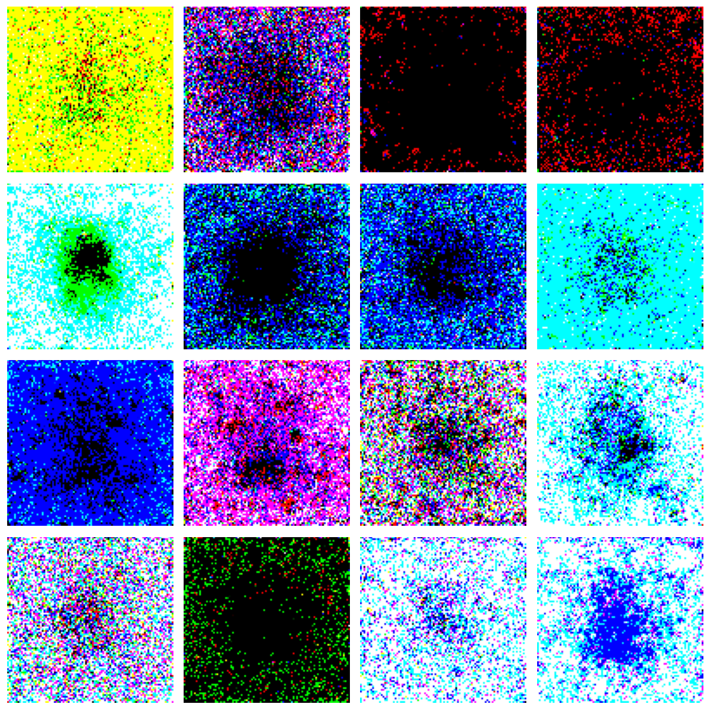

# Pokemon Genesis

A conditional diffusion model trained from scratch in PyTorch on ~1300 Pokemon sprites, with classifier-free guidance for type-based generation.

## Showcase



*Samples from the run 2 model (29M params, 800 epochs). Each row corresponds to a different `type1` conditioning. Sampling: DDIM, 200 steps, guidance scale 2.5.*

## What this is

An end-to-end implementation of DDPM/DDIM-style diffusion **without high-level wrappers** (no `diffusers`, no `peft`). The U-Net, attention blocks, noise schedule, sampler, EMA, training loop — all hand-coded.

The model is conditioned on `type1` (18 Pokemon types: fire, water, grass, ...) via classifier-free guidance. Conditioning is implemented in two flavors compared in run 2 / run 3 (additive embedding vs cross-attention).

## Method

### Forward process

Standard DDPM closed form:

$$x_t = \sqrt{\bar{\alpha}_t}\,x_0 + \sqrt{1 - \bar{\alpha}_t}\,\varepsilon, \quad \varepsilon \sim \mathcal{N}(0, I)$$

with `T = 1000` timesteps and a **cosine schedule** for $\bar{\alpha}_t$ (Nichol & Dhariwal 2021), implemented and unit-tested in `src/diffusion/schedule.py`.

### Architecture (U-Net)

29M-parameter U-Net with 4 resolution levels (96 → 48 → 24 → 12 → 6 spatial).

```
Encoder:   stem → [ResBlock × 3 + (Attn if 12 or 6) + Downsample] × 4
Bottleneck: ResBlock → AttentionBlock → ResBlock (at 6×6)
Decoder:   [Upsample + concat(skip) + ResBlock × 3 + (Attn?)] × 4 → head
```

- **Sinusoidal time embedding** + 2-layer MLP (`d → 4d → d`)
- **Class embedding** with an extra slot for the CFG null token (`nn.Embedding(num_classes + 1, dim)`)
- **GroupNorm** (8 groups) + **SiLU** activations
- **Self-attention** at the two deepest spatial resolutions (12×12, 6×6)
- **Skip connections** with channel-wise concatenation
- **EMA** copy of model weights (decay 0.999) used for sampling

The conditioning path can be toggled in `configs/config.yaml`:
- `cond_mode: additive` — class embedding is summed with time embedding, then projected into each ResBlock
- `cond_mode: cross_attn` — class is expanded into 4 tokens that the spatial features cross-attend to (Stable-Diffusion style)

A second flag `selective_cond` controls whether the encoder + bottleneck see the class signal at all, or only the decoder does.

### Training

- **Loss**: MSE between predicted and ground-truth noise
- **CFG dropout** of 10–40% (the class is replaced by a null token during a fraction of training steps) to enable classifier-free guidance at inference
- **AdamW**, lr `2e-4`, gradient clipping at 1.0
- **Batch size** 32, **`WeightedRandomSampler`** to balance the 18 type classes (which are imbalanced by a factor of ~15×)
- **800–1500 epochs**

### Sampling

Deterministic **DDIM** with classifier-free guidance:

$$\hat{\varepsilon} = \varepsilon_\text{uncond} + w \cdot (\varepsilon_\text{cond} - \varepsilon_\text{uncond})$$

Typically 50–200 sampling steps with `w ∈ [1.5, 3]`.

## Data

Source: official sprites from [PokeAPI](https://pokeapi.co/) (front_default, 96×96, RGBA).

- 1025 base Pokemon (Gen 1 → Gen 9, including DLCs) + ~275 alternate forms (Megas, regional variants, Gigamax) = **~1300 unique sprites**
- After **dual-type expansion** (each dual-type Pokemon appears once per type), the training dataset is **~2000 entries**
- Augmentation: **horizontal flip** (p=0.5) — color/translation augmentations were intentionally skipped because the conditioning is tightly coupled to color (a "fire" with shifted colors would be inconsistent)

### Engineering note: corrupted PNGs

A handful of PokeAPI sprites ship with a broken `iCCP` chunk that PIL refuses to open (`UnidentifiedImageError`). `scripts/prepare_data.py` detects and re-encodes them in place without that chunk; `scripts/fix_data.py` does the same as a standalone tool.

## Experimental results

Three training runs progressively adding improvements:

| Run | Architecture | Data tricks | CFG drop | Epochs | Final loss | Visual outcome |
|---|---|---|---|---|---|---|
| **1** | Additive cond | none | 0.1 | 800 | 0.0095 | Silhouettes appear, type-color barely visible |
| **2** | Additive cond | WeightedSampler + dual-type + hflip + alt forms | 0.2 | 800 | 0.0080 | **Type-color alignment visible** (red for fire, blue for water, green for grass) — best run |
| **3** | Cross-attention + selective cond | same as run 2 | 0.4 | 1000 (interrupted) | 0.0060 | Lower train loss but visual quality on par with run 2; the +9M parameters of cross-attention overfit on 1300 samples |

The training loss decreases monotonically across all runs. Going from run 2 to run 3 lowered the loss but **did not improve sample quality** — a textbook case of training metric / visual quality decoupling.

## Limitations

### Dataset size is the bottleneck

1300 sprites for 18 classes means roughly 70 samples per class. This is two to three orders of magnitude smaller than what is typical for diffusion model training (CIFAR-10 has 50k images; ImageNet 1.2M). The model learns:

- Spatial priors (centered creature, contour outline)
- Per-class color palette (partial)

…but not fine-grained features (eyes, limbs, distinguishing details).

### Dark silhouettes

A recurring artifact: generated samples often have **dark/black centers** surrounded by saturated background colors of the conditioned type. Two root causes identified:

1. **Training distribution**: every Pokemon sprite has thick dark outlines. The model picks up "Pokemon center = dark pixels" as a high-signal feature.
2. **CFG amplification**: higher guidance scale amplifies whatever the conditional path has learned. The conditional path encodes "fire = red surroundings + dark Pokemon shape", and the unconditional path is weaker, so the difference is exaggerated.

Sampling with `guidance_scale ≈ 1.5–2.0` instead of 3.0+ mitigates the artifact significantly. Run 3 (cfg_drop_prob = 0.4) also showed cleaner unconditional outputs.

### What would help, not done here

- **Min-SNR loss weighting** (Hang et al. 2023) — 10-line change, typically +10-15% sample quality
- **Pretraining unconditional then fine-tuning conditional** — disentangle shape learning from class learning
- **Scaling the dataset to 5–10k samples** — back sprites (×2), Pokemon HOME 3D renders, Sugimori artwork — but each comes with style-mismatch risk
- **Different architecture** — a GAN baseline (StyleGAN2-ADA) could give sharper outputs on this scale; DiT would likely overfit

## Project structure

```
pokemon-diffusion-generator/
├── README.md
├── requirements.txt
├── configs/
│   └── config.yaml                  # all hyperparameters in one file
├── notebooks/
│   ├── 01_explore_dataset.ipynb     # EDA on the 1300 sprites
│   └── 02_visualize_forward_diffusion.ipynb
├── scripts/
│   ├── prepare_data.py              # PokeAPI scraper + iCCP fix
│   ├── train_diffusion.py           # main training CLI (supports --resume)
│   ├── generate.py                  # inference CLI
│   └── fix_data.py                  # standalone iCCP chunk stripper
├── src/
│   ├── data.py                      # PokemonDataset + dual-type expansion
│   └── diffusion/
│       ├── schedule.py              # linear + cosine noise schedules
│       ├── blocks.py                # ResBlock, AttentionBlock, CrossAttention, Down/Up
│       ├── unet.py                  # full conditional U-Net
│       ├── diffusion.py             # q_sample, loss with CFG, DDIM sampler
│       ├── ema.py                   # EMA weights wrapper
│       └── train.py                 # training loop with wandb + checkpointing
└── tests/
    └── test_schedule.py             # pytest for noise schedule invariants
```

## Reproduce

### 1. Environment

```bash
conda create -n pokemon-genesis python=3.11 -y
conda activate pokemon-genesis
pip install -r requirements.txt
```

### 2. Fetch the dataset (~5 min)

```bash
python scripts/prepare_data.py
```

### 3. Train

```bash
# wandb auth (one-time)
wandb login

# Train with defaults (reproduces run 2)
python scripts/train_diffusion.py

# Or resume from a checkpoint
python scripts/train_diffusion.py --resume checkpoints/epoch_0500.pt
```

All hyperparameters in `configs/config.yaml`. Toggle `unet.cond_mode` (`additive` ↔ `cross_attn`) and `unet.selective_cond` to switch architectures.

Logs stream to wandb. Checkpoints saved in `checkpoints/` every 50 epochs (gitignored).

### 4. Generate samples

```bash
python scripts/generate.py \
    --ckpt checkpoints/epoch_0799.pt \
    --classes fire,grass,water,bug \
    --samples_per_class 4 \
    --guidance_scale 2.5 \
    --num_steps 200 \
    --cond_mode additive \
    --out outputs/test.png
```

### 5. Tests

```bash
pytest tests/
```

## Hardware

- **Local dev**: Mac M3 with MPS backend (slow but works for code/debug)
- **Training**: Google Colab A100 (~1 hour for 800 epochs on the run 2 setup, ~9 credits)
- **Inference**: a single A100 generates a 4×4 grid in ~5 seconds

## References

- Ho, Jain, Abbeel — *Denoising Diffusion Probabilistic Models* (NeurIPS 2020) — [arxiv](https://arxiv.org/abs/2006.11239)
- Song, Meng, Ermon — *Denoising Diffusion Implicit Models* (ICLR 2021) — [arxiv](https://arxiv.org/abs/2010.02502)
- Nichol, Dhariwal — *Improved Denoising Diffusion Probabilistic Models* (2021) — [arxiv](https://arxiv.org/abs/2102.09672)
- Ho, Salimans — *Classifier-Free Diffusion Guidance* (NeurIPS 2021 Workshop) — [arxiv](https://arxiv.org/abs/2207.12598)
- Hang et al. — *Efficient Diffusion Training via Min-SNR Weighting Strategy* (2023) — [arxiv](https://arxiv.org/abs/2303.09556)
- Rombach et al. — *High-Resolution Image Synthesis with Latent Diffusion Models* (Stable Diffusion, 2022) — [arxiv](https://arxiv.org/abs/2112.10752)
